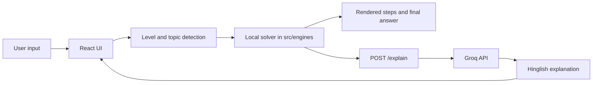

# GanitYantra

[](https://vite.dev/)
[](https://react.dev/)
[](https://fastapi.tiangolo.com/)
[](https://groq.com/)

GanitYantra is a hybrid math-solver application with a React + Vite frontend and a FastAPI backend. It solves supported math problems locally, renders step-by-step solutions with KaTeX, and then asks Groq for a short Hinglish explanation tailored to the selected education level.

## Features

- Level-aware math experience for Class 6-8, 9-10, 11-12, UG/B.Tech, and PG/PhD.
- Automatic level detection from the problem text.
- Local solving for arithmetic and quadratic-style problems before any AI request.
- Step-by-step solution rendering with KaTeX math output.
- AI-generated Hinglish explanation from the backend using Groq.
- Example problem chips for quick input.
- Keyboard shortcut support for solving with Ctrl/Cmd + Enter.
- Lightweight single-page interface with a custom dark visual style.

## Tech Stack

| Area | Detected technologies | Notes |
|---|---|---|
| Frontend technologies | React 19, Vite, JavaScript, inline CSS, KaTeX, react-katex, mathjs | Single-page React app with client-side rendering. |
| Backend technologies | FastAPI, Uvicorn, Pydantic, python-dotenv, Groq SDK, CORS middleware | Backend exposes `/explain` and `/health`. |
| Database | Not detected in project | No ORM, client, or persistence layer found. |
| Authentication | Not detected in project | No login, sessions, JWT, or token flow found. |
| State Management | React local state only | No Redux, Zustand, MobX, or external state library detected. |
| Deployment tools | Vite build pipeline, Uvicorn | No Docker, Compose, Vercel, or Netlify config detected. |
| Other important libraries | eslint, eslint-plugin-react-hooks, eslint-plugin-react-refresh, @vitejs/plugin-react, globals | Linting and developer tooling. |

## Project Structure

```text
ganityantra/
├── backend/
│   ├── main.py
│   └── .env
├── public/
│   ├── favicon.svg
│   └── icons.svg
├── src/
│   ├── App.jsx
│   ├── App.css
│   ├── index.css
│   ├── main.jsx
│   ├── assets/
│   ├── components/
│   │   ├── AIExplanation.jsx
│   │   ├── FinalAnswer.jsx
│   │   ├── Header.jsx
│   │   ├── InputArea.jsx
│   │   ├── KaTeXRenderer.jsx
│   │   ├── LevelSelector.jsx
│   │   └── StepDisplay.jsx
│   └── engines/
│       ├── arithmeticSolver.js
│       ├── index.js
│       └── quadraticSolver.js
├── eslint.config.js
├── index.html
├── package.json
├── package-lock.json
├── README.md
└── vite.config.js
```

### Major folders and files

| Path | Purpose |
|---|---|
| `src/App.jsx` | Main application shell. It contains level detection, local solving orchestration, AI explanation fetching, KaTeX loading, and the full UI composition. |
| `src/components/` | Reusable UI components for the header, input area, solution steps, final answer, AI explanation panel, level selector, and KaTeX rendering. |
| `src/engines/` | Deterministic math solver layer. Arithmetic and quadratic solvers live here, with `index.js` acting as the single import surface. |
| `src/assets/` | Empty at the moment. No app-specific assets were detected there. |
| `public/` | Static public assets used by Vite, currently favicon and icon SVGs. |
| `backend/main.py` | FastAPI app that sends step explanations to Groq and exposes `/explain` plus `/health`. |
| `backend/.env` | Local environment file for secrets. The detected key is not documented here for security reasons. |
| `package.json` | Frontend scripts and dependencies. |
| `package-lock.json` | npm lockfile that pins installed frontend dependency versions. |
| `vite.config.js` | Vite configuration. No custom proxy or alias configuration detected. |
| `eslint.config.js` | ESLint flat config for JavaScript/JSX linting. |
| `index.html` | Vite HTML entry point that mounts the React app. |

### Pages, services, and utilities

- Pages: Not detected in project. The app is implemented as a single-page experience in `src/App.jsx`.
- Services: No standalone `services/` folder detected. Backend communication is handled directly in `src/App.jsx` and `backend/main.py`.
- Utilities: No dedicated `utils/` folder detected. Shared math logic lives under `src/engines/`.

## Installation

### 1. Prerequisites

- Node.js 18+ recommended.
- npm.
- Python 3.10+ recommended.

### 2. Install frontend dependencies

```bash
npm install
```

### 3. Set up the backend environment

Create `backend/.env` from the sample below and add your Groq API key.

```env
GROQ_KEY=your_groq_api_key_here
```

If you prefer, copy the sample file:

```bash
copy backend\.env.example backend\.env
```

### 4. Install backend dependencies

The repository does not include `requirements.txt`, so install the Python packages used by `backend/main.py` manually.

```bash
python -m venv .venv
.venv\Scripts\activate
pip install fastapi uvicorn python-dotenv groq pydantic
```

## Environment Variables

| Variable | Location | Purpose | Required |
|---|---|---|---|
| `GROQ_KEY` | `backend/.env` | Authenticates requests from the FastAPI backend to Groq. | Yes |
| Frontend env vars | Not detected in project | No frontend environment variables were found. The frontend currently uses a hardcoded backend URL. | No |

### Sample `backend/.env.example`

```env
GROQ_KEY=your_groq_api_key_here
```

## Available Scripts

| Script | Command | Purpose |
|---|---|---|
| `dev` | `vite` | Starts the Vite development server with HMR. |
| `build` | `vite build` | Builds the production frontend bundle into `dist/`. |
| `lint` | `eslint .` | Lints the repository using the configured ESLint rules. |
| `preview` | `vite preview` | Serves the production build locally for verification. |

## Usage

Start the backend from the `backend/` directory and the frontend from the repository root.

### Backend

```bash
cd backend
uvicorn main:app --reload --port 8000
```

### Frontend

```bash
cd ..
npm run dev
```

Open the Vite URL shown in the terminal, then enter a supported math problem such as:

- `LCM of 12 and 18`
- `x^2 - 5x + 6 = 0`
- `3/4 + 1/2`
- `15% of 240`

## Build for Production

### Frontend build

```bash
npm run build
```

### Preview the production build

```bash
npm run preview
```

### Backend production start

```bash
cd backend
uvicorn main:app --host 0.0.0.0 --port 8000
```

## Deployment

The project appears to be designed for separate frontend and backend deployment.

1. Build the frontend with `npm run build` and deploy the generated static files from `dist/` to a static host.
2. Deploy the FastAPI backend with a production ASGI server such as Uvicorn behind a reverse proxy.
3. Set `GROQ_KEY` in the backend deployment environment.
4. Update the frontend backend URL from `http://127.0.0.1:8000/explain` to your deployed API base URL.
5. Tighten CORS in production. The current backend config allows all origins, methods, and headers.

### Deployment notes

- Vite has no custom proxy configured, so frontend-to-backend connectivity must be handled explicitly in deployment.
- No Docker, Compose, Vercel, or Netlify configuration was detected in the repository.
- If deploying the frontend separately, ensure the API URL is exposed through an environment variable or build-time replacement in code.

## API Documentation

### `POST /explain`

Generates a short Hinglish explanation for a solved math problem.

#### Request body

```json
{
	"problem": "x^2 - 5x + 6 = 0",
	"steps": [
		{ "latex": "x^2 - 5x + 6 = 0", "explanation": "Standard form" }
	],
	"level": "class910",
	"topic": "quadratic"
}
```

#### Response

```json
{
	"explanation": "..."
}
```

### `GET /health`

Returns a simple health check response.

```json
{
	"status": "ok"
}
```

### External AI integration

- Provider: Groq
- SDK: `groq`
- Model detected: `llama-3.3-70b-versatile`
- Usage: backend-only request from `backend/main.py`

## Key Components

| Component | Responsibility |
|---|---|
| `src/App.jsx` | Owns the full user flow: detect level and topic, solve locally, reveal steps, and request an AI explanation. |
| `src/engines/arithmeticSolver.js` | Handles arithmetic topics such as LCM/HCF, fractions, percentages, ratio/proportion, exponents, and prime factorization. |
| `src/engines/quadraticSolver.js` | Handles quadratic families such as standard, vertex, factored, pure, bi-quadratic, exponential, trigonometric, logarithmic, and radical forms. |
| `src/components/KaTeXRenderer.jsx` | Renders LaTeX output with KaTeX, falling back safely when rendering fails. |
| `src/components/StepDisplay.jsx` | Displays solution steps with progressive reveal behavior. |
| `src/components/AIExplanation.jsx` | Displays the backend-generated explanation and loading state. |
| `src/components/FinalAnswer.jsx` | Displays the final answer card with optional LaTeX rendering. |
| `backend/main.py` | Exposes the explanation API and forwards structured prompts to Groq. |

## Architecture Overview



The application follows a hybrid client/server flow. The frontend first determines the likely level and topic, then runs the matching local solver to produce deterministic steps and the final answer. After that, it sends the problem and generated steps to the backend, which asks Groq to produce a concise Hinglish explanation. The UI then renders the math output through KaTeX and shows the AI explanation separately.

## Performance Optimizations

- Local solving happens before the AI request, so the core answer does not depend on network latency.
- Only the structured problem summary and steps are sent to the backend for explanation.
- KaTeX assets are loaded on demand from the CDN after the app mounts instead of being bundled into the main initial payload.
- The math solver routes to the narrowest matching engine first, which keeps unsupported branches from doing unnecessary work.

## Security Considerations

- `GROQ_KEY` is kept server-side and read from the backend environment.
- No frontend secret handling was detected.
- The backend currently allows all CORS origins, methods, and headers. This is suitable for local development only and should be restricted in production.
- The frontend currently uses a hardcoded backend URL. For production, that URL should be externalized so it can be changed safely per environment.
- No authentication, authorization, token handling, or database security layer was detected in the project.

## Future Improvements

- Externalize the backend API URL into a frontend environment variable.
- Add a checked-in `requirements.txt` or Python dependency lock file for the backend.
- Split `src/App.jsx` into smaller route-level or feature-level modules if the UI grows.
- Remove the hardcoded development-oriented CORS configuration before production deployment.
- Add automated tests for the solver engines and backend API.
- Introduce routing only if the project expands beyond a single-page experience.
- Add a real component import path in `App.jsx` if the reusable components under `src/components/` are intended to be the source of truth.

## Contributing

1. Create a branch for your change.
2. Keep changes focused and consistent with the existing JavaScript style.
3. Run `npm run lint` and verify the frontend still builds.
4. If you change backend behavior, validate the FastAPI server manually as well.
5. Update the README or `.env.example` when you add new environment variables or scripts.

## License

Not detected in project. Add a license file before publishing or distributing the application.

## Package Manager Files

- `package.json`: present and active.
- `package-lock.json`: present and active.
- `yarn.lock`: not detected in project.
- `pnpm-lock.yaml`: not detected in project.
