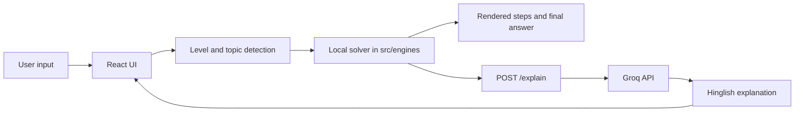

# GanitYantra

[](https://vite.dev/)
[](https://react.dev/)
[](https://fastapi.tiangolo.com/)
[](https://groq.com/)

GanitYantra is a hybrid math-solver application with a React + Vite frontend and a FastAPI backend. It solves supported math problems locally, renders step-by-step solutions with KaTeX, and then asks Groq for a short Hinglish explanation tailored to the selected education level.

## Features

- Level-aware math experience for Class 6-8, 9-10, 11-12, UG/B.Tech, and PG/PhD.
- Automatic level detection from the problem text.
- Local solving for arithmetic and quadratic-style problems before any AI request.
- Step-by-step solution rendering with KaTeX math output.
- AI-generated Hinglish explanation from the backend using Groq.
- Example problem chips for quick input.
- Keyboard shortcut support for solving with Ctrl/Cmd + Enter.
- Lightweight single-page interface with a custom dark visual style.

## Quick Start

Prerequisites:

- Node.js 18+ and npm
- Python 3.10+

1) Install frontend dependencies

```bash
npm install
```

2) Start the frontend (development)

```bash
npm run dev
```

3) Backend: set your Groq API key and run FastAPI

Create `backend/.env` (or set `GROQ_KEY` in your environment):

```env
GROQ_KEY=your_groq_api_key_here
```

Install (recommended in a virtualenv) and run the backend:

```bash
python -m venv .venv
.venv\Scripts\activate    # Windows
pip install fastapi uvicorn python-dotenv groq pydantic
cd backend
uvicorn main:app --reload --port 8000
```

Open the Vite URL shown in the frontend terminal and use the app.

## Tech Stack

| Area | Technologies | Notes |
|---|---|---|
| Frontend technologies | React 19, Vite, JavaScript, inline CSS, KaTeX, react-katex, mathjs | Single-page React app with client-side rendering. |
| Backend technologies | FastAPI, Uvicorn, Pydantic, python-dotenv, Groq SDK, CORS middleware | Backend exposes `/explain` and `/health`. |
| Database | Not used | No ORM, client, or persistence layer. |
| Authentication | Not used | No login, sessions, JWT, or token flow. |
| State Management | React local state only | No Redux, Zustand, MobX, or external state library. |
| Deployment tools | Vite build pipeline, Uvicorn | No Docker, Compose, Vercel, or Netlify config. |
| Other important libraries | eslint, eslint-plugin-react-hooks, eslint-plugin-react-refresh, @vitejs/plugin-react, globals | Linting and developer tooling. |

## Project Structure

```text
ganityantra/
├── backend/
│   ├── main.py
│   └── .env
├── public/
│   ├── favicon.svg
│   └── icons.svg
├── src/
│   ├── App.jsx
│   ├── App.css
│   ├── index.css
│   ├── main.jsx
│   ├── assets/
│   ├── components/
│   │   ├── AIExplanation.jsx
│   │   ├── FinalAnswer.jsx
│   │   ├── Header.jsx
│   │   ├── InputArea.jsx
│   │   ├── KaTeXRenderer.jsx
│   │   ├── LevelSelector.jsx
│   │   └── StepDisplay.jsx
│   ├── config/
│   │   └── levels.js
│   ├── engines/
│   │   ├── arithmeticSolver.js
│   │   ├── index.js
│   │   └── quadraticSolver.js
│   ├── services/
│   │   └── aiService.js
│   └── utils/
│       ├── detectLevel.js
│       ├── detectTopic.js
│       └── solveLocally.js
├── eslint.config.js
├── index.html
├── package.json
├── package-lock.json
├── README.md
└── vite.config.js
```

### Major Folders and Files

| Path | Purpose |
|---|---|
| `src/App.jsx` | Main application shell. Contains level detection, local solving orchestration, AI explanation fetching, KaTeX loading, and full UI composition. |
| `src/components/` | Reusable UI components for header, input area, solution steps, final answer, AI explanation panel, level selector, and KaTeX rendering. |
| `src/engines/` | Deterministic math solver layer. Arithmetic and quadratic solvers live here, with `index.js` acting as the single import surface. |
| `src/config/` | Configuration files including education level definitions. |
| `src/services/` | Backend communication and AI-related service calls. |
| `src/utils/` | Utility functions for level detection, topic detection, and local problem-solving. |
| `src/assets/` | App-specific assets (currently empty). |
| `public/` | Static public assets used by Vite (favicon and icon SVGs). |
| `backend/main.py` | FastAPI app that sends step explanations to Groq and exposes `/explain` plus `/health`. |
| `backend/.env` | Local environment file for secrets. |
| `package.json` | Frontend scripts and dependencies. |
| `vite.config.js` | Vite configuration. |
| `eslint.config.js` | ESLint flat config for JavaScript/JSX linting. |
| `index.html` | Vite HTML entry point that mounts the React app. |

## Available Scripts

| Script | Command | Purpose |
|---|---|---|
| `dev` | `vite` | Starts the Vite development server with HMR. |
| `build` | `vite build` | Builds the production frontend bundle into `dist/`. |
| `lint` | `eslint .` | Lints the repository using the configured ESLint rules. |
| `preview` | `vite preview` | Serves the production build locally for verification. |

## Backend API

### `POST /explain`

Generates a short Hinglish explanation for a solved math problem.

**Request body:**

```json
{
  "problem": "x^2 - 5x + 6 = 0",
  "steps": [
    { "latex": "x^2 - 5x + 6 = 0", "explanation": "Standard form" }
  ],
  "level": "class910",
  "topic": "quadratic"
}
```

**Response:**

```json
{
  "explanation": "..."
}
```

### `GET /health`

Returns a simple health check response.

```json
{
  "status": "ok"
}
```

## Environment Variables

| Variable | Location | Purpose | Required |
|---|---|---|---|
| `GROQ_KEY` | `backend/.env` | Authenticates requests from the FastAPI backend to Groq. | Yes |

## Key Components

| Component | Responsibility |
|---|---|
| `src/App.jsx` | Owns the full user flow: detect level and topic, solve locally, reveal steps, and request an AI explanation. |
| `src/engines/arithmeticSolver.js` | Handles arithmetic topics such as LCM/HCF, fractions, percentages, ratio/proportion, exponents, and prime factorization. |
| `src/engines/quadraticSolver.js` | Handles quadratic families such as standard, vertex, factored, pure, bi-quadratic, exponential, trigonometric, logarithmic, and radical forms. |
| `src/components/KaTeXRenderer.jsx` | Renders LaTeX output with KaTeX, falling back safely when rendering fails. |
| `src/components/StepDisplay.jsx` | Displays solution steps with progressive reveal behavior. |
| `src/components/AIExplanation.jsx` | Displays the backend-generated explanation and loading state. |
| `src/components/FinalAnswer.jsx` | Displays the final answer card with optional LaTeX rendering. |
| `src/services/aiService.js` | Handles backend API calls for AI explanations. |
| `src/utils/detectLevel.js` | Detects education level from problem text. |
| `src/utils/detectTopic.js` | Detects problem topic (arithmetic, quadratic, etc.). |
| `backend/main.py` | FastAPI app that exposes `/explain` and `/health` endpoints. |

## Architecture Overview



The application follows a hybrid client/server flow:
1. Frontend detects the education level and problem topic.
2. Frontend runs the matching local solver to produce deterministic steps and final answer.
3. Frontend sends the problem and generated steps to the backend.
4. Backend asks Groq to produce a concise Hinglish explanation.
5. UI renders the math output through KaTeX and displays the AI explanation.

## Performance Optimizations

- Local solving happens before the AI request, so the core answer does not depend on network latency.
- Only the structured problem summary and steps are sent to the backend for explanation.
- KaTeX assets are loaded on demand from the CDN after the app mounts instead of being bundled into the main payload.
- The math solver routes to the narrowest matching engine first, which keeps unsupported branches from doing unnecessary work.

## Security Considerations

- `GROQ_KEY` is kept server-side and read from the backend environment.
- No frontend secret handling is used.
- The backend currently allows all CORS origins, methods, and headers. This is suitable for local development only and should be restricted in production.
- The frontend currently uses a hardcoded backend URL. For production, that URL should be externalized so it can be changed safely per environment.
- No authentication, authorization, token handling, or database security layer is present in the project.

## Notes & Recommendations

- The backend uses the `groq` SDK and expects `GROQ_KEY` in the environment (see [backend/main.py](backend/main.py)).
- CORS is permissive for local development; restrict origins in production.
- Consider adding `backend/requirements.txt` for reproducible backend installs.
- Externalize the frontend API base URL before deploying.

## Contributing

1. Create a branch for your change.
2. Run `npm run lint` and verify the frontend builds.
3. If you modify backend behavior, test the FastAPI server locally.
4. Update the README when you add new environment variables or scripts.

## License

Add a `LICENSE` file to declare a project license before publishing.

---
Updated README: added Quick Start at the top while preserving full project structure, tech stack, and component details.
